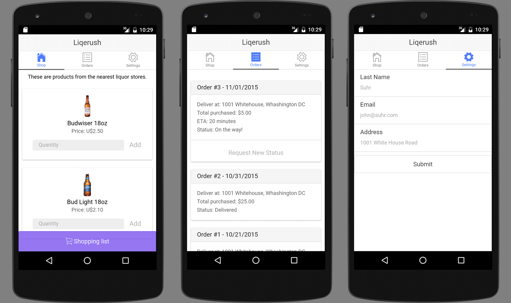

# Liqerush

This project won the second place on HBCUHacks 2016. The backend is not in this repository.

## What it does?
This is an app for ordering liquor from anywhere. It was design using **ionic**.

## Using this project

First of all, isntall cordova & ionic:
```bash
$ npm i -g cordova ionic@1.7.0
```

Then install the project dependencies:
```bash
$ cd IAMAR-Hackathon-Project && npm i
```

To start this project and run it on Google Chrome:

```bash
$ ionic serve
```

Or run it on an emulator:

```bash
$ ionic run
```

## How does it look?

